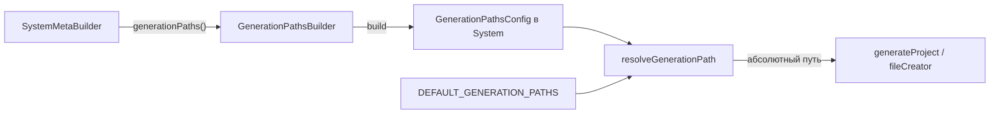

# Интерфейс путей генерации

Спецификация по созвону 02.07.2026.

Билдер путей по **категориям** генерируемых файлов. Дефолт = нынешние hardcode-пути в генераторах. Генераторы в момент записи файла берут путь из билдера, а не из локального `join(...)`.

Стиль API — как у storage (`setStorage` / модуль `storage.ts`): fluent-сеттеры и реестр, без изолированного «магического» класса со стороны.

> Layout / монорепо (`runlify.json` paths, staging meta, shared schema) в этот документ **не входят**.

---

## Модель



**Корень файла** по-прежнему `detachedBackProject` или `detachedUiProject`. Билдер задаёт только **относительный шаблон** внутри корня.

---

## Файлы в runlify (целевая раскладка)

| Файл | Назначение |
|------|------------|
| `src/projectsGeneration/builders/generationPaths.ts` | Категории, дефолты, `resolveGenerationPath` |
| `src/projectsGeneration/builders/GenerationPathsBuilder.ts` | Билдер |
| `SystemMetaBuilder.generationPaths()` | Точка входа из меты |
| `buildedTypes` / generation args | Прокидка `GenerationPathsConfig` в генераторы |

---

## Типизация категорий и параметров (обязательно)

Чтобы нельзя было опечататься в имени категории или плейсхолдера:

1. **Категории** — закрытый union из `as const` объекта (как `Storage`), **без** `| string`.
2. `setPath(category, …)` принимает только `GenerationPathCategory` → опечатка ловится TypeScript’ом.
3. **Параметры шаблона** — закрытый union `GenerationPathParam`; `vars` типизирован как `Partial<Record<GenerationPathParam, string>>` (или более узкий набор на категорию).
4. В шаблоне допустимы только `{Param}` из этого списка; неизвестный `{foo}` — ошибка на `resolve` / ideally на `setPath` при статическом разборе.

Добавление новой категории или параметра — только явным расширением const/union + дефолта в реестре.

---

## TypeScript API

```ts
/** Каталог-корень артефакта */
export type GenerationPathRoot = 'back' | 'ui'

/**
 * Единый источник правды по именам категорий.
 * Паттерн как у Storage: const + typeof → union.
 * НЕ допускать `| string` и свободных литералов вне этого объекта.
 */
export const GenerationPathCategory = {
  // —— MVP: back hooks / service ——
  BackHookBeforeCreate: 'back.hook.beforeCreate',
  BackHookAfterCreate: 'back.hook.afterCreate',
  BackHookBeforeUpdate: 'back.hook.beforeUpdate',
  BackHookAfterUpdate: 'back.hook.afterUpdate',
  BackHookBeforeDelete: 'back.hook.beforeDelete',
  BackHookAfterDelete: 'back.hook.afterDelete',
  BackHookBeforeUpsert: 'back.hook.beforeUpsert',
  BackHookChangeListFilter: 'back.hook.changeListFilter',
  BackHookAdditionalOperationsOnCreate: 'back.hook.additionalOperationsOnCreate',
  BackHookAdditionalOperationsOnUpdate: 'back.hook.additionalOperationsOnUpdate',
  BackHookAdditionalOperationsOnDelete: 'back.hook.additionalOperationsOnDelete',
  BackHookTenantIdRequiredHooks: 'back.hook.tenantIdRequiredHooks',
  BackHookInitUserHooks: 'back.hook.initUserHooks',
  BackHookInitBuiltInHooks: 'back.hook.initBuiltInHooks',
  BackServiceClass: 'back.service.class',
  BackServiceAdditionalClass: 'back.service.additionalClass',
  BackServiceConfig: 'back.service.config',
  BackServiceBaseServices: 'back.service.baseServices',
  BackServiceServiceConstrictors: 'back.service.serviceConstrictors',
  // —— MVP: ui CRUD ——
  UiPageShowMainTab: 'ui.page.show.MainTab',
  UiPageShowDefaultMainTab: 'ui.page.show.DefaultMainTab',
  UiPageShowDefaultEntityShow: 'ui.page.show.DefaultEntityShow',
  UiPageShowDefaultActions: 'ui.page.show.DefaultActions',
  UiPageShowIndex: 'ui.page.show.index',
  UiPageShowAdditionalTabs: 'ui.page.show.additionalTabs',
  UiPageShowDependencyTab: 'ui.page.show.dependencyTab',
  UiPageCreateDefault: 'ui.page.create.Default',
  UiPageCreateIndex: 'ui.page.create.index',
  UiPageEditDefault: 'ui.page.edit.Default',
  UiPageEditIndex: 'ui.page.edit.index',
  UiPageListDefault: 'ui.page.list.Default',
  UiPageListFilter: 'ui.page.list.filter',
  UiPageListDefaultFilter: 'ui.page.list.DefaultFilter',
  UiPageListBreadcrumbs: 'ui.page.list.breadcrumbs',
  UiPageListIndex: 'ui.page.list.index',
  UiPageIcon: 'ui.page.icon',
  UiPageValidation: 'ui.page.validation',
} as const

export type GenerationPathCategory =
  (typeof GenerationPathCategory)[keyof typeof GenerationPathCategory]

/**
 * Допустимые параметры шаблона пути.
 * В строке пути пишутся как {entityName}, {ServiceName}, …
 * Свободные имена запрещены.
 */
export const GenerationPathParam = {
  entityName: 'entityName',
  ServiceName: 'ServiceName',
  pascalSingular: 'pascalSingular',
  PascalEntity: 'PascalEntity',
  camelPlural: 'camelPlural',
  OwnerPascal: 'OwnerPascal',
  FromFieldPascal: 'FromFieldPascal',
  serviceName: 'serviceName',
  ServicePascal: 'ServicePascal',
  clientName: 'clientName',
  ClientPascal: 'ClientPascal',
  restApiName: 'restApiName',
  entityTypePlural: 'entityTypePlural',
  langId: 'langId',
  database: 'database',
} as const

export type GenerationPathParam =
  (typeof GenerationPathParam)[keyof typeof GenerationPathParam]

/** Шаблон относительно detachedBack / detachedUi; плейсхолдеры только из GenerationPathParam */
export type GenerationPathTemplate = string

export type GenerationPathVars = Partial<Record<GenerationPathParam, string>>

export interface GenerationPathDefinition {
  root: GenerationPathRoot
  /** Дефолт = нынешний hardcode */
  defaultTemplate: GenerationPathTemplate
  /**
   * Какие params обязан/может передать оркестратор для этой категории.
   * Нужен для документации и проверки полноты vars на resolve.
   */
  params: readonly GenerationPathParam[]
}

/** Реестр обязан покрывать ВСЕ значения GenerationPathCategory (exhaustiveness) */
export type GenerationPathsRegistry = {
  [K in GenerationPathCategory]: GenerationPathDefinition
}

export interface GenerationPathsConfig {
  overrides: Partial<Record<GenerationPathCategory, GenerationPathTemplate>>
}

export interface ResolveGenerationPathArgs {
  category: GenerationPathCategory
  detachedBackProject: string
  detachedUiProject: string
  pathsConfig?: GenerationPathsConfig | null
  vars: GenerationPathVars
}

export function resolveGenerationPath(args: ResolveGenerationPathArgs): string
```

### Билдер

```ts
class GenerationPathsBuilder {
  private overrides: GenerationPathsConfig['overrides'] = {}

  setPath(
    category: GenerationPathCategory, // только из GenerationPathCategory
    template: GenerationPathTemplate,
  ): this {
    this.overrides[category] = template
    return this
  }

  build(): GenerationPathsConfig {
    return { overrides: { ...this.overrides } }
  }
}
```

### Доступ из меты

```ts
import {GenerationPathCategory} from 'runlify'

system
  .generationPaths()
  .setPath(
    GenerationPathCategory.BackHookBeforeCreate, // не строка «от руки»
    'src/custom/hooks/{ServiceName}/beforeCreate.ts',
  )

// Ошибка компиляции:
// .setPath('back.hook.beforeCreat', '...')  // опечатка
// .setPath('foo.bar', '...')                // не из union
```

Без вызовов `setPath` → `overrides: {}` → все пути из `DEFAULT_GENERATION_PATHS` → поведение как сейчас.

---

## Допустимые параметры шаблона

Полный закрытый набор (MVP + запас под backlog). Других `{…}` в шаблонах быть не должно.

| Param (`GenerationPathParam`) | В шаблоне | Откуда значение | Где нужен (типично) |
|-------------------------------|-----------|-----------------|---------------------|
| `entityName` | `{entityName}` | `entity.name` | ui pages, docs entity |
| `ServiceName` | `{ServiceName}` | `pascalPlural(entity.name) + 'Service'` | back hooks / entity service |
| `pascalSingular` | `{pascalSingular}` | `pascalSingular(entity.name)` | ui pages (папки/файлы) |
| `PascalEntity` | `{PascalEntity}` | `pascal(entity.name)` | init, widgets |
| `camelPlural` | `{camelPlural}` | `camelPlural(entity.name)` | back graph entity folder |
| `OwnerPascal` | `{OwnerPascal}` | pascal владельца связи | `ui.page.show.dependencyTab` |
| `FromFieldPascal` | `{FromFieldPascal}` | pascal поля связи | `ui.page.show.dependencyTab` |
| `serviceName` | `{serviceName}` | additional service `name` | additional service / graph |
| `ServicePascal` | `{ServicePascal}` | `pascal(serviceName)` | additional service |
| `clientName` | `{clientName}` | integration client `name` | integration clients / docs |
| `ClientPascal` | `{ClientPascal}` | `pascalCase(clientName)` | integration client class |
| `restApiName` | `{restApiName}` | REST API name | docs restApi |
| `entityTypePlural` | `{entityTypePlural}` | `plural(entity.type)` | docs `catalogs/`… |
| `langId` | `{langId}` | id языка | ui i18n |
| `database` | `{database}` | имя доп. БД ≠ `main` | prisma `databases/{database}` |

Правила resolve:

1. Из шаблона собираются все `{Param}`.
2. Каждый Param ∈ `GenerationPathParam`, иначе throw.
3. Каждый Param из `definition.params` (или встреченный в итоговом шаблоне) должен быть в `vars`, иначе throw.
4. Лишние ключи в `vars` игнорируются.

Для MVP-категорий достаточный набор params:

| Группа категорий | `params` |
|------------------|----------|
| `back.hook.*`, `back.service.class/additionalClass/config` | `ServiceName` |
| `back.service.baseServices`, `back.service.serviceConstrictors` | _(нет — путь константа)_ |
| `ui.page.*` кроме dependencyTab | `entityName`, `pascalSingular` |
| `ui.page.show.dependencyTab` | `entityName`, `pascalSingular`, `OwnerPascal`, `FromFieldPascal` |

---

## Обратная совместимость

| Правило | Следствие |
|---------|-----------|
| Нет overrides | `resolveGenerationPath` ≡ нынешний `join(root, …)` |
| Override одной категории | остальные без изменений |
| `create` / `createIfNotExists` | задаются оркестратором как сейчас, **не** билдером путей |
| Существующие проекты | не обязаны менять мету |

---

## Реестр дефолтов (MVP)

Пути сняты с текущих call sites в `generateProject/**`.

### Back hooks / service

| Category | root | defaultTemplate | mode |
|----------|------|-----------------|------|
| `back.hook.beforeCreate` | back | `src/adm/services/{ServiceName}/hooks/beforeCreate.ts` | ifNotExists |
| `back.hook.beforeUpdate` | back | `src/adm/services/{ServiceName}/hooks/beforeUpdate.ts` | ifNotExists |
| `back.hook.beforeDelete` | back | `src/adm/services/{ServiceName}/hooks/beforeDelete.ts` | ifNotExists |
| `back.hook.beforeUpsert` | back | `src/adm/services/{ServiceName}/hooks/beforeUpsert.ts` | ifNotExists |
| `back.hook.afterCreate` | back | `src/adm/services/{ServiceName}/hooks/afterCreate.ts` | ifNotExists |
| `back.hook.afterUpdate` | back | `src/adm/services/{ServiceName}/hooks/afterUpdate.ts` | ifNotExists |
| `back.hook.afterDelete` | back | `src/adm/services/{ServiceName}/hooks/afterDelete.ts` | ifNotExists |
| `back.hook.changeListFilter` | back | `src/adm/services/{ServiceName}/hooks/changeListFilter.ts` | ifNotExists |
| `back.hook.additionalOperationsOnCreate` | back | `src/adm/services/{ServiceName}/hooks/additionalOperationsOnCreate.ts` | ifNotExists |
| `back.hook.additionalOperationsOnUpdate` | back | `src/adm/services/{ServiceName}/hooks/additionalOperationsOnUpdate.ts` | ifNotExists |
| `back.hook.additionalOperationsOnDelete` | back | `src/adm/services/{ServiceName}/hooks/additionalOperationsOnDelete.ts` | ifNotExists |
| `back.hook.tenantIdRequiredHooks` | back | `src/adm/services/{ServiceName}/hooks/tenantIdRequiredHooks.ts` | create |
| `back.hook.initUserHooks` | back | `src/adm/services/{ServiceName}/initUserHooks.ts` | ifNotExists |
| `back.hook.initBuiltInHooks` | back | `src/adm/services/{ServiceName}/initBuiltInHooks.ts` | create |
| `back.service.class` | back | `src/adm/services/{ServiceName}/{ServiceName}.ts` | create |
| `back.service.additionalClass` | back | `src/adm/services/{ServiceName}/Additional{ServiceName}.ts` | ifNotExists |
| `back.service.config` | back | `src/adm/services/{ServiceName}/config.ts` | create |
| `back.service.baseServices` | back | `src/adm/services/BaseServices.ts` | create |
| `back.service.serviceConstrictors` | back | `src/adm/services/serviceConstrictors.ts` | create |

Оркестраторы: `generateBackEntityService.ts`, `generateBackServices.ts`.

### UI pages

| Category | root | defaultTemplate | mode |
|----------|------|-----------------|------|
| `ui.page.show.MainTab` | ui | `src/adm/pages/{entityName}/{pascalSingular}Show/MainTab.tsx` | ifNotExists |
| `ui.page.show.DefaultMainTab` | ui | `src/adm/pages/{entityName}/{pascalSingular}Show/DefaultMainTab.tsx` | create |
| `ui.page.show.DefaultEntityShow` | ui | `src/adm/pages/{entityName}/{pascalSingular}Show/Default{pascalSingular}Show.tsx` | create |
| `ui.page.show.DefaultActions` | ui | `src/adm/pages/{entityName}/{pascalSingular}Show/DefaultActions.tsx` | create |
| `ui.page.show.index` | ui | `src/adm/pages/{entityName}/{pascalSingular}Show/index.tsx` | ifNotExists |
| `ui.page.show.additionalTabs` | ui | `src/adm/pages/{entityName}/{pascalSingular}Show/additionalTabs.tsx` | ifNotExists |
| `ui.page.show.dependencyTab` | ui | `src/adm/pages/{entityName}/{pascalSingular}Show/tabs/{OwnerPascal}{FromFieldPascal}Tab.tsx` | create |
| `ui.page.create.Default` | ui | `src/adm/pages/{entityName}/{pascalSingular}Create/Default{pascalSingular}Create.tsx` | create |
| `ui.page.create.index` | ui | `src/adm/pages/{entityName}/{pascalSingular}Create/index.tsx` | ifNotExists |
| `ui.page.edit.Default` | ui | `src/adm/pages/{entityName}/{pascalSingular}Edit/Default{pascalSingular}Edit.tsx` | create |
| `ui.page.edit.index` | ui | `src/adm/pages/{entityName}/{pascalSingular}Edit/index.tsx` | ifNotExists |
| `ui.page.list.Default` | ui | `src/adm/pages/{entityName}/{pascalSingular}List/Default{pascalSingular}List.tsx` | create |
| `ui.page.list.filter` | ui | `src/adm/pages/{entityName}/{pascalSingular}List/{pascalSingular}Filter.tsx` | ifNotExists |
| `ui.page.list.DefaultFilter` | ui | `src/adm/pages/{entityName}/{pascalSingular}List/Default{pascalSingular}Filter.tsx` | create |
| `ui.page.list.breadcrumbs` | ui | `src/adm/pages/{entityName}/{pascalSingular}List/{pascalSingular}ListBreadcrumbs.tsx` | ifNotExists |
| `ui.page.list.index` | ui | `src/adm/pages/{entityName}/{pascalSingular}List/index.tsx` | ifNotExists |
| `ui.page.icon` | ui | `src/adm/pages/{entityName}/{pascalSingular}Icon.tsx` | create |
| `ui.page.validation` | ui | `src/adm/pages/{entityName}/get{pascalSingular}Validation.tsx` | create |

Оркестраторы: `generateFrontSrcEntityPages.ts`, icon/validation generators.

### Backlog после MVP

**Back:** graph entity/additional/help, enums/init, prisma/shards/databases, env/clients, charts/ci/docker, docs, integration clients, HelpService, AdditionalServices.

**UI:** widgets, resources/chunks/routes/menu, i18n, App/layout/dataProvider, charts/ci/docker, docs.

`GenerationPathCategory` расширяется по мере миграции пакетов в `generateProject/**`.

---

## Пример resolve

```ts
import {GenerationPathCategory} from 'runlify'

// без override:
resolveGenerationPath({
  category: GenerationPathCategory.BackHookBeforeCreate,
  detachedBackProject: 'D:/work/rlw-back',
  detachedUiProject: 'D:/work/rlw-ui',
  pathsConfig: null,
  vars: { ServiceName: 'UsersService' },
})
// → D:/work/rlw-back/src/adm/services/UsersService/hooks/beforeCreate.ts

// с override:
pathsConfig.overrides[GenerationPathCategory.BackHookBeforeCreate] =
  'src/custom/hooks/{ServiceName}/beforeCreate.ts'
// → D:/work/rlw-back/src/custom/hooks/UsersService/beforeCreate.ts
```

---

## Порядок внедрения

1. Интерфейс + MVP-реестр в коде (`generationPaths.ts` с `as const` категориями/params, builder, `SystemMetaBuilder.generationPaths()`).
2. Прокинуть `GenerationPathsConfig` в generation args.
3. `resolveGenerationPath` + unit-тесты: дефолт ≡ старый путь; override одной категории; reject неизвестного `{param}` и опечатки категории на уровне типов.
4. Заменить `join` в `generateBackEntityService` (hooks first).
5. UI pages, затем остальное.
6. `fileCleaners` для мигрированных категорий.

---

## Вне scope

- Monorepo layout / `runlify.json` paths / staging meta / sharedSchema
- Entity-level path overrides
- Смена семантики `create` vs `createIfNotExists` через билдер путей

---

## Критерии готовности

- [ ] Категории — `as const` + union **без** `| string`; `setPath` не принимает произвольную строку
- [ ] Параметры шаблона — закрытый `GenerationPathParam`; перечислены в доке и в коде
- [ ] В мете: `system.generationPaths().setPath(GenerationPathCategory.…, …)`
- [ ] Без `setPath` — те же пути, что сейчас
- [ ] Пакет `back.hook.*` идёт через `resolveGenerationPath`
- [ ] Дефолты MVP совпадают с текущим hardcode
